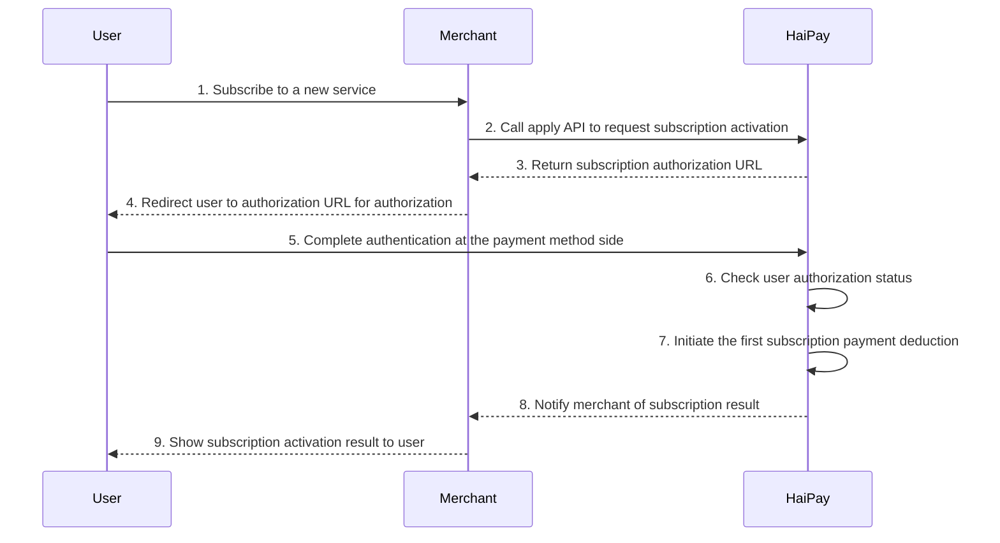
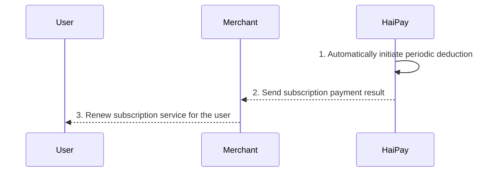
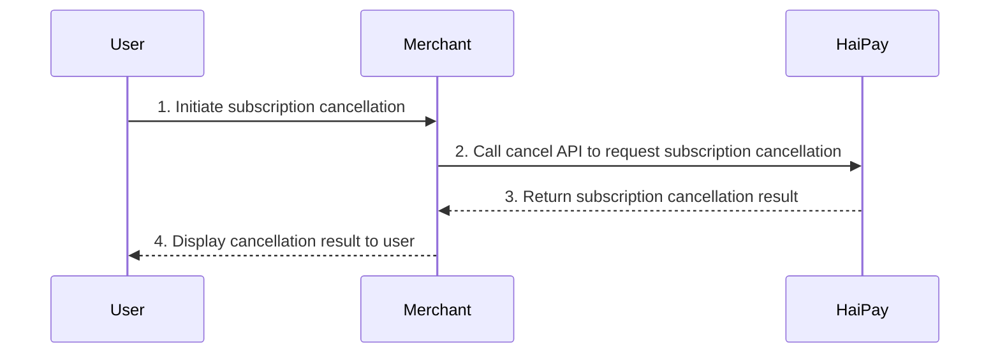
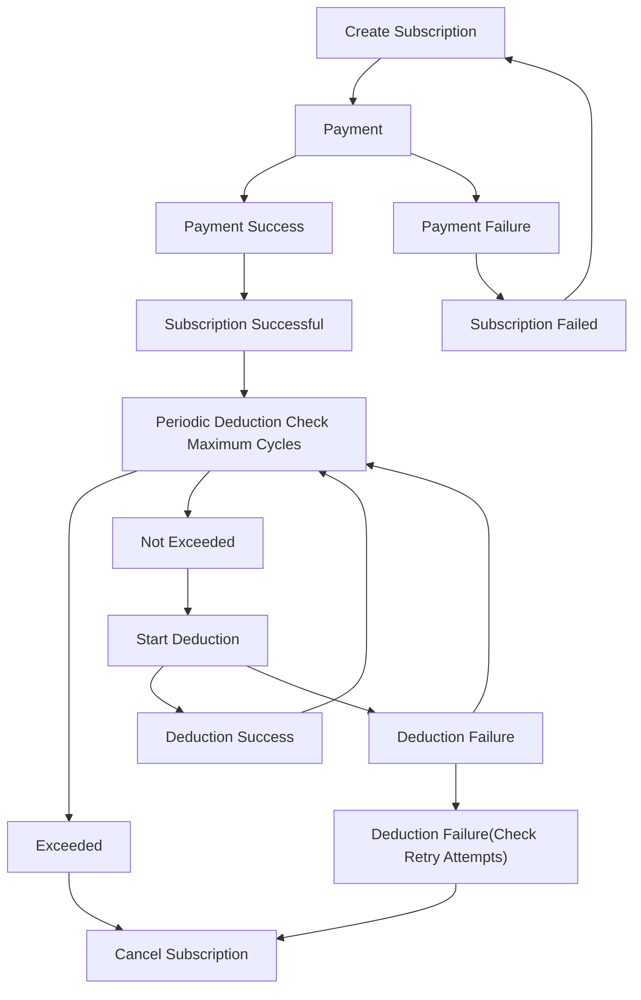

### Create Subscription

```mermaid
sequenceDiagram
    participant User
    participant Merchant
    participant HaiPay

    User->>Merchant: 1. Subscribe to a new service
    Merchant->>HaiPay: 2. Call apply API to request subscription activation
    HaiPay-->>Merchant: 3. Return subscription authorization URL
    Merchant-->>User: 4. Redirect user to authorization URL for authorization
    User->>HaiPay: 5. Complete authentication at the payment method side
    HaiPay->>HaiPay: 6. Check user authorization status
    HaiPay->>HaiPay: 7. Initiate the first subscription payment deduction
    HaiPay-->>Merchant: 8. Notify merchant of subscription result
    Merchant-->>User: 9. Show subscription activation result to user
```

### Subscription Payment Notification

```mermaid
sequenceDiagram
    participant User
    participant Merchant
    participant HaiPay

    HaiPay->>HaiPay: 1. Automatically initiate periodic deduction
    HaiPay-->>Merchant: 2. Send subscription payment result
    Merchant-->>User: 3. Renew subscription service for the user
```

### Cancel Subscription

```mermaid
sequenceDiagram
    participant User
    participant Merchant
    participant HaiPay

    User->>Merchant: 1. Initiate subscription cancellation
    Merchant->>HaiPay: 2. Call cancel API to request subscription cancellation
    HaiPay-->>Merchant: 3. Return subscription cancellation result
    Merchant-->>User: 4. Display cancellation result to user
```

### Complete Subscription Flow

```mermaid
graph TD
  A[Create Subscription] --> B[Payment]
  B --> C[Payment Success]
  B --> D[Payment Failure]
  D --> E[Subscription Failed]
  E --> A
  C --> F[Subscription Successful]
  F --> G[Periodic Deduction Check Maximum Cycles]
  G --> N[Exceeded]
  N --> M[Cancel Subscription]
  G --> L[Not Exceeded]
  L --> O[Start Deduction]
  O --> H[Deduction Success]
  H --> G
  O --> I[Deduction Failure]
  I --> G
  I --> K["Deduction Failure(Check Retry Attempts)"]
  K --> M[Cancel Subscription]
```