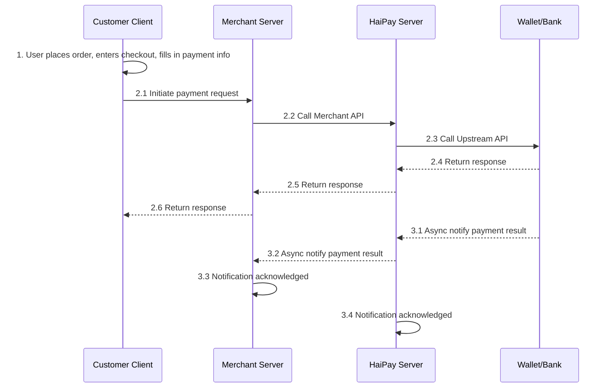
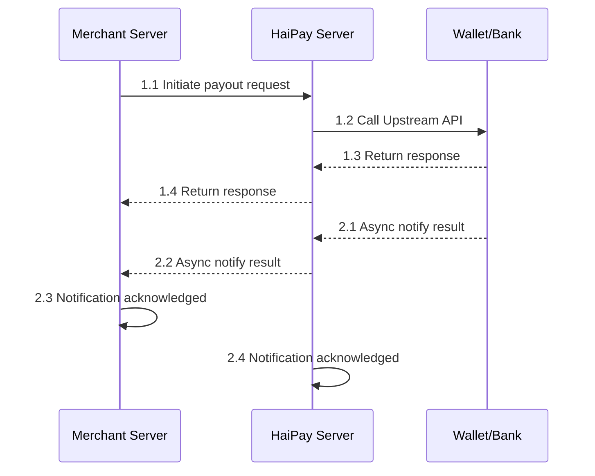

# Integration Steps

Merchants who want to display payment methods to users and accept payments on their own checkout page can integrate HaiPay using a pure API (Direct API) approach.

For Direct API interfaces, merchants must have PCI-DSS certification if they handle card number information themselves.

## 1. Collection Process

## 2. Payment Process

## 3. API Parameters
For details, please refer to: [API Description](/en/docs/guide/api_description_guide.md)

## 4. End-to-End Testing
For details, please refer to: [End-to-End Testing](/en/docs/guide/end_to_end_testing.md)
