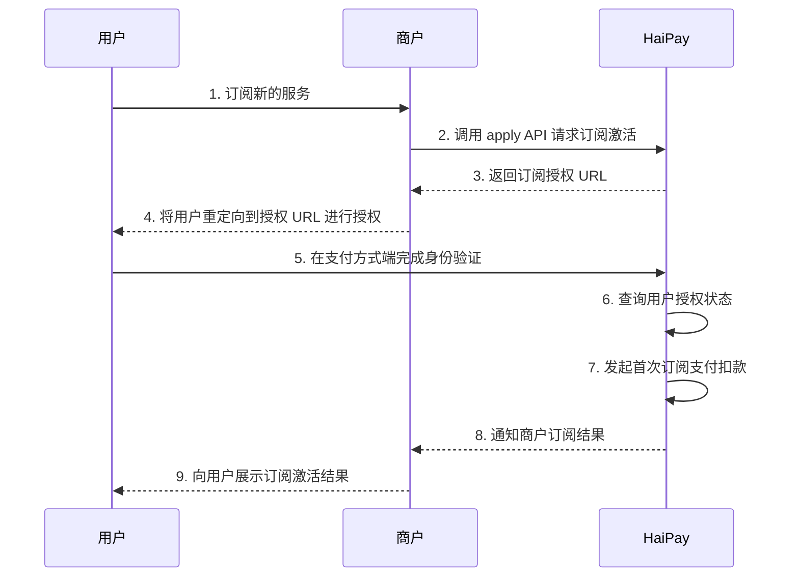
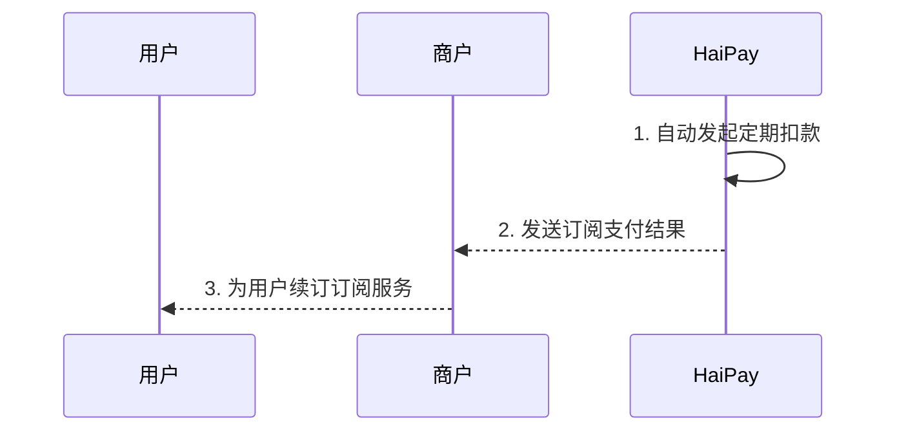
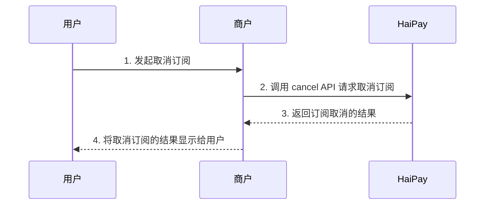
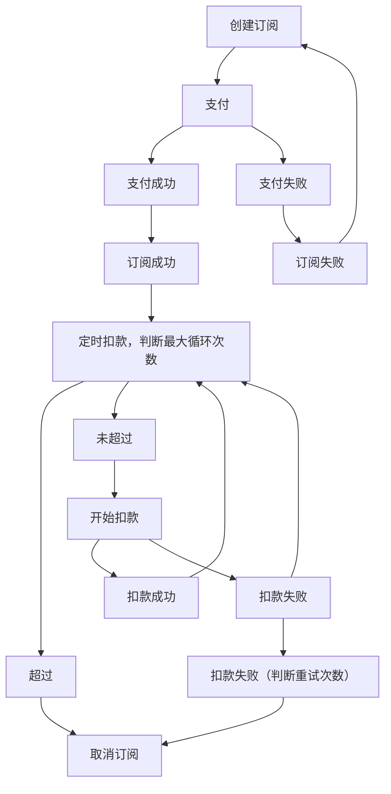

### 创建订阅

```mermaid
sequenceDiagram
    participant 用户
    participant 商户
    participant HaiPay

    用户->>商户: 1. 订阅新的服务
    商户->>HaiPay: 2. 调用 apply API 请求订阅激活
    HaiPay-->>商户: 3. 返回订阅授权 URL
    商户-->>用户: 4. 将用户重定向到授权 URL 进行授权
    用户->>HaiPay: 5. 在支付方式端完成身份验证
    HaiPay->>HaiPay: 6. 查询用户授权状态
    HaiPay->>HaiPay: 7. 发起首次订阅支付扣款
    HaiPay-->>商户: 8. 通知商户订阅结果
    商户-->>用户: 9. 向用户展示订阅激活结果
```

### 订阅支付通知

```mermaid
sequenceDiagram
    participant 用户
    participant 商户
    participant HaiPay

    HaiPay->>HaiPay: 1. 自动发起定期扣款
    HaiPay-->>商户: 2. 发送订阅支付结果
    商户-->>用户: 3. 为用户续订订阅服务
```

### 取消订阅

```mermaid
sequenceDiagram
    participant 用户
    participant 商户
    participant HaiPay

    用户->>商户: 1. 发起取消订阅
    商户->>HaiPay: 2. 调用 cancel API 请求取消订阅
    HaiPay-->>商户: 3. 返回订阅取消的结果
    商户-->>用户: 4. 将取消订阅的结果显示给用户
```

### 订阅完整流程

```mermaid
graph TD
  A[创建订阅] --> B[支付]
  B --> C[支付成功]
  B --> D[支付失败]
  D --> E[订阅失败]
  E --> A
  C --> F[订阅成功]
  F --> G[定时扣款，判断最大循环次数]
  G --> N[超过]
  N --> M[取消订阅]
  G --> L[未超过]
  L --> O[开始扣款]
  O --> H[扣款成功]
  H --> G
  O --> I[扣款失败]
  I --> G
  I --> K[扣款失败（判断重试次数）]
  K --> M[取消订阅]
```