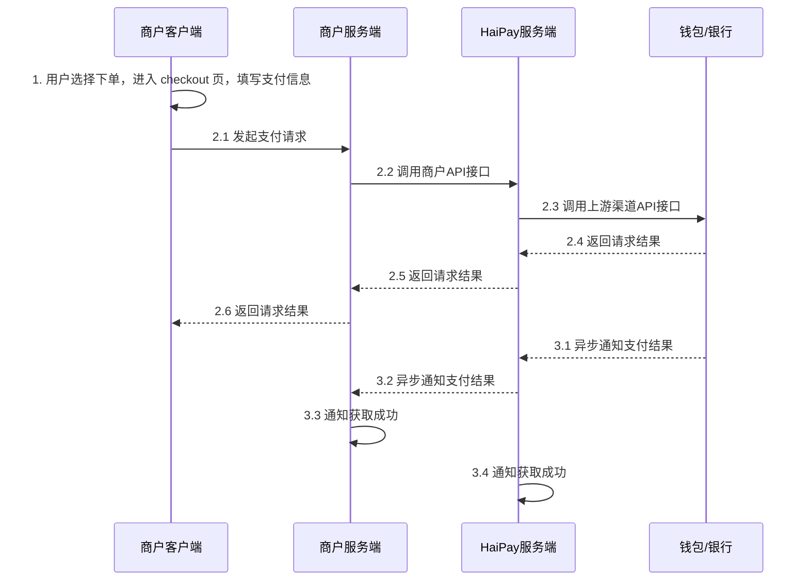
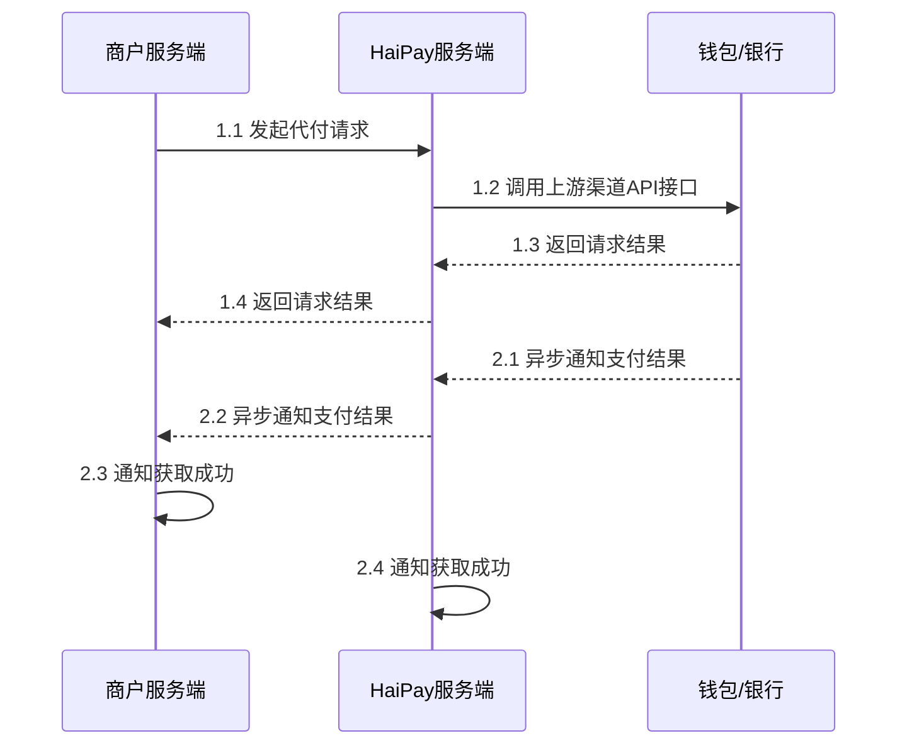

# 集成步骤

商户希望在自己的收银台上给用户展示支付方式并支付，HaiPay提供纯API（Direct API）的方式接入。

对于Direct API的接口，商户如果自行处理卡号信息，需要具备PCI-DSS认证资质。

## 1. 代收流程

## 2. 代付流程

## 3. 接口参数
详情参阅：[接口说明](/zh/docs/guide/api_description_guide.md)

## 4. 端到端测试
详情参阅：[端到端测试](/zh/docs/guide/end_to_end_testing.md)
